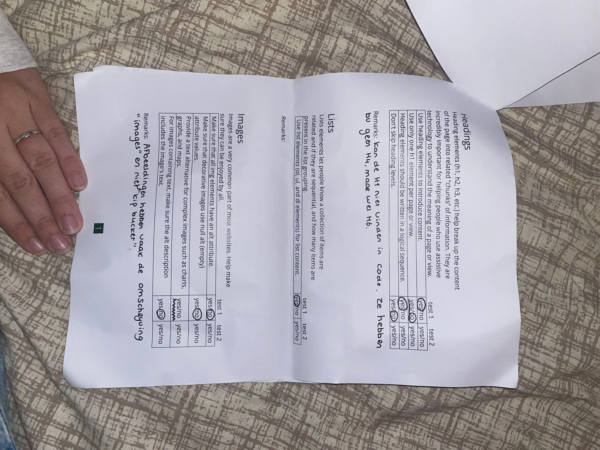
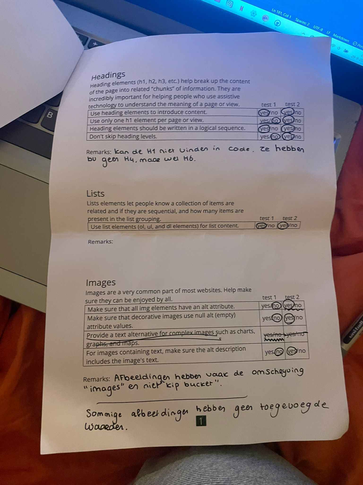

# Procesverslag
Markdown is een simpele manier om HTML te schrijven.  
Markdown cheat cheet: [Hulp bij het schrijven van Markdown](https://github.com/adam-p/markdown-here/wiki/Markdown-Cheatsheet).

Nb. De standaardstructuur en de spartaanse opmaak van de README.md zijn helemaal prima. Het gaat om de inhoud van je procesverslag. Besteedt de tijd voor pracht en praal aan je website.

Nb. Door *open* toe te voegen aan een *details* element kun je deze standaard open zetten. Fijn om dat steeds voor de relevante stuk(ken) te doen.

## Jij

  
uitwerken voor kick-off werkgroep

  ### Auteur:
Yade Kleton

  #### Je startniveau:
blauw

  #### Je focus:
 surface plane
 

## Je website

  
uitwerken voor kick-off werkgroep

  ### Je opdracht:
https://www.kfc.nl/

  #### Screenshot(s) van de eerste pagina (small screen): 
KFC homepage
  
  

  #### Screenshot(s) van de tweede pagina (small screen):
KFC Nieuwsbrief pagina
  
 

## Toegankelijkheidstest 1/2 (week 1)

  
uitwerken na test in 2e werkgroep

  ### Bevindingen
  Lijst met je bevindingen die in de test naar voren kwamen:
  Wat mij opviel tijdens de screen reader test:
  - hij zegt dingen die ik niet in het scherm kan zien
  - als je op 2 drukt (om naar header 2 te gaan) springt hij naar de onderkant van de pagina. Dit zijn natuurlijk gewoon de headers, maar je kan dus niet normaal door de pagina "lezen", want je springt meteen naar beneden. 
  - de buttons heten niet buttons, maar link
  afbeeldingen worden vaak images genoemd en niet wat er op de afbeelding te zien is. 

  ### foto's van mobiel formaat waar fouten te zien zijn: 
  
   

  ### foto's van documenten met test resultaten: 
  
  
  
  

## Breakdownschets (week 1)

  
uitwerken na afloop 3e werkgroep

  ### de hele pagina: 
  

  ### dynamisch deel (bijv menu): 
  

  ### wellicht nog een dynamisch deel (bijv filter): 
  

## Voortgang 1 (week 2)

  
uitwerken voor 1e voortgang

  ### Stand van zaken
Ik heb de basis van html staan, maar begrijp nog niet helemaal wanneer ik section, article en div mag gebruiken. Dit heb ik aan een klas genoot Mitchel gevraagd. Verder ben ik nog niet echt bezig geweest met de css, maar heb ik wel wat vragen die ik in het feedback moment kan gaan vragen. 

  

  ### Agenda voor meeting
  Mijn vragen:
  - Hoe maak ik een flexbox in html?
  - Is het erg als het alleen op telefoon formaat is?
  - mag een h1 een afbeelding zijn (logo)?
  - hoe kan je er voor zorgen dat je css niet op de andere pagina werkt als je bijvoorbeeld end of type zegt?

  ### Verslag van meeting
  hier na afloop snel de uitkomsten van de meeting vastleggen

  - punt 1
  - sws teloon formaat, responsive is handig, maar animatie is leuker. animatie van de les is goed genoeg, doe dat dat vind je leuker
  - Ja, de h1 beschrijft de pagina
  - Door op de body van de 2de pagina (als die de minste deatials etc heeft) een class of id te zetten. Zo kan je alles veranderen    
    zonder dat de andere pagina mee bewerkt. 

## Voortgang 2 (week 3)

  
uitwerken voor 2e voortgang

  ### Stand van zaken
Ik probeerde een hamburger menu na te maken, maar dit lukte mij niet. Ik moet dus een andere manier vinden om java scipt te verwerken, want dat is een stapje te moeilijk voor mij.

  ### Agenda voor meeting
  - Hoe stel ik een donker en licht thema in
  - hoe maak ik buttons toegankelijker
  - wat voor java script kan ik er in doen ipv een hamburger menu.

  ### Verslag van meeting
  hier na afloop snel de uitkomsten van de meeting vastleggen

  - met @media 
  - door een ari-label toe te voegen aan buttons waar het niet duidelijk is wat ze doen, zoals met afbeeldingen in de button en geen tekst. 
  - je kan een knop laten veranderen van kleur met java script.

  - Stop var (titel) in je code ipv #code, dan kan je eht makkelijker en sneller aanpassen.

## Toegankelijkheidstest 2/2 (week 4)

  
uitwerken na test in 9e werkgroep

  ### Bevindingen
  Lijst met je bevindingen die in de test naar voren kwamen (geef ook aan wat er verbeterd is):
  - alle buttons hebben een unieke naam
  - waar nodig zitten er ari labels op de buttons 
  - de nodige afbeeldingen hebben een alt tekst en de decoratieve afbeeldingen hebben er geen.
  
  ### foto's van documenten met test resultaten: 
  
  
  
  

## Voortgang 3 (week 4)

  
uitwerken voor 3e voortgang

  ### Stand van zaken
mijn 2de pagina stond al snel en nu kan ik gaan animeren! ik ga de opdrachten op DLO opnieuw maken en heb een leuke curser toegevoegd.  

  ### Agenda voor meeting
  mijn vragen:

  - klopt mij formulier zo
  - de animaites van de zoen is met list etc kan dat anders

  ### Verslag van meeting
  - Om je UX beter te maken moet je de input en label koppelen. Dat kan met een id of het in de label zelf zetten. 
  - geen list nodig kan alles zijn zoals 
 of <button>, dus dan is het button:hover { animatie name: etc}.
  - ik moet nog java script met classlist, queryselector etc toevoegen in de site. 

## Eindgesprek (week 5)

  
uitwerken voor eindgesprek

  ### Je uitkomst - karakteristiek screenshots:
  

  ### Dit ging goed/Heb ik geleerd: 
  - Ik heb geleerd hoe ik buttons kan animeren
  - ook heb ik geleerd hoe je een slider kan maken met afbeeldingen
  - mijn geheugen is opgesfrist over html, css en java script
  - ik weet nu ook hoe je flex boxen, articles enzo kan gebruiken
  - ik kan nu formulieren maken!

  - ik weet nu hoe ik aantekeningen kan in html, css en java lol

  

  ### Dit was lastig/Is niet gelukt:
  - het is mij niet gelukt om een hamburger menu te maken
  - ik heb best wel wat onderdelen uit de site gehouden, omdat mij die te moeilijk leken. de code en de basis dingen opzich vond ik al een uitdaging op zichzelf. 

  

## Bronnenlijst

  
continu bijhouden terwijl je werkt

  Nb. Wees specifiek ('css-tricks' als bron is bijv. niet specifiek genoeg). 
  Nb. ChatGpT en andere AI horen er ook bij.
  Nb. Vermeld de bronnen ook in je code.

  1. <!-- bron voor de slider (heb dit stap voor stap gevolgd en soms chat GPT extra uitleg gevraagd): https://webdesign.tutsplus.com/how-to-build-a-simple-carousel-with-vanilla-javascript--cms-41734t -->
  2. <!-- bron om de h1 onzichtbaar te maken: Chat GPT -->

